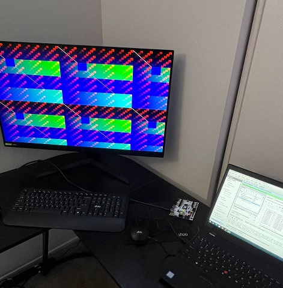

# HDMI Out

The following design is implemented on Arty Z7-20 FPGA board in Vivado 2019.1. Please check the reference for details about the code, HDMI connector, video and TMDS signals.

NOTE:
The main source code has been implemented in ISE, hence, some changes have been done for implementing the design in Vivado 2019.1.

Used language templates in Vivado and changed the configuration for each port:

1- Differential output buffer (OBUFDS)

2- Clock multiplier -> Mixed-Mode Clock Manager (MMCM)

Photo of the output pattern generated from the FPGA:

----------------------------------
Reference:
https://www.fpga4fun.com/HDMI.html
